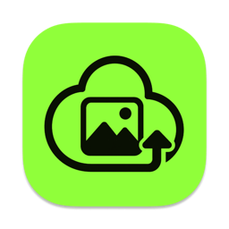
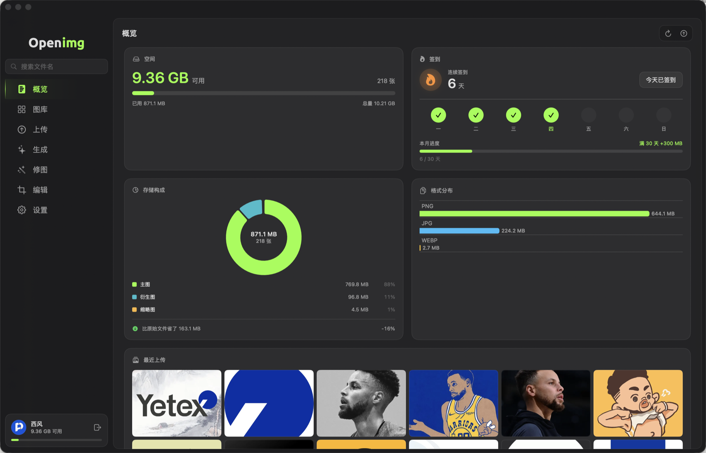

  

<h1 align="center">Openimg for macOS</h1>

  把图拖进来，链接直接进剪贴板。 
  免费图床 <a href="https://openimg.io">openimg.io</a> 的 macOS 客户端。

  
  
  
  
  
  

## 这个东西解决什么问题

写文档、发帖子、回帖，图不能直接贴 —— 得先传到某个地方拿到链接。这件事一天要做十几次，
而每次都是：打开网页、找到上传按钮、选文件、等、复制链接、切回来。

Openimg 把这段路压成一步：**图拖进窗口，链接已经在剪贴板里了。**

适合这些人：

- 写 Markdown 的 —— 博客、文档、README，图多且链接格式固定
- 在论坛和群里发图的 —— 要外链，要 BBCode
- 需要图片长期可访问的 —— 不想哪天图床跑路，所以支持绑自己的 R2 / S3
- 在意隐私的 —— 照片里的定位信息在上传前就抹掉了

## 下载

从 [Releases](https://github.com/gentpan/openimg-app/releases/latest) 下载 zip，
解压后把 **Openimg** 拖进「应用程序」，**双击打开**。

不需要右键打开，也不用去系统设置里点「仍要打开」—— 这个 app 经过 Apple 公证。

需要 macOS 14 或更新版本，Apple 芯片的 Mac。

第一次打开可以直接在里面注册，也可以用已有账号登录：邮箱密码、Google、GitHub、
或者 Passkey（用触控 ID 免密登录）。登录一次之后就一直记着，重开不用再输。

## 能做什么

### 传图，拿链接

把图拖进窗口，或者按 ⌘U 选文件。传完链接自动进剪贴板 —— 可以选要
直链、Markdown、HTML 还是 BBCode。

**照片里的定位信息会在上传前抹掉。** 图床链接是公开的，谁都能看；不抹的话，
你发进群里的照片会带着拍摄地点一起公开。

图片默认转成 WebP 存储，通常小一半，画质看不出差别。也可以选 AVIF 或者保留原格式。

### 挂个文件夹，自动上传

选一个文件夹交给它盯着，之后往里放的图会自动传上去。截图存到桌面、
相机导入到某个目录，都不用再手动拖一次。

传过的图有记录，不会因为重复上传白扣空间。空间不够或者到了当天上限会自己停下来，
第二天自动接着传。

### 传之前先改一下

裁剪、旋转、加水印，还有马赛克。

马赛克是像素化或者纯色块 —— **不用高斯模糊，因为高斯模糊能被还原出来**。要遮的
东西就该真的遮住。

水印可以是文字也可以是图片，位置、大小、透明度都能调。水印在你的 Mac 上就合成好了
再传，不经过服务器。

### 让 AI 出图、改图

**生成图片**：写一句描述，出图之后自动进图库，和你自己传的图完全一样 ——
一样有外链、短链、备份。

**修图**：从图库挑几张，或者直接拖本地文件进来，告诉它要改什么。常用的都有一键预设：

去水印 · 去除路人杂物 · 换背景 · 修复老照片 · 黑白上色 · 人像精修 · 提升清晰度……

关联 [pic.bi](https://pic.bi) 账号之后可以出 4K。

### 找图，管图

图库支持搜索和翻页，多选批量删除，双击全窗看大图。右键可以直接进编辑器。

**整库导出**：把你传过的所有图一次性下载到本地文件夹。已经下过的自动跳过，
中断了下次接着来。

### 存到你自己的桶

不想用平台的存储池，可以绑自己的：

Cloudflare R2 · AWS S3 · Backblaze B2 · DigitalOcean Spaces · 阿里云 OSS ·
腾讯云 COS，以及任何 S3 兼容的自建服务。

密钥加密保存，界面上只显示掩码。

### 看看用了多少

概览页有剩余空间、存储构成、格式分布、上传趋势和空间流水。

每天可以签到领空间，连续签到有额外奖励 —— 满一周、满一月各有一次。

## 换个样子

两套配色，绿和紫，和网站同步。切换主题时 Dock 里的图标也会跟着变。

界面中英双语，切换立即生效。

## 自己搭了服务器？

登录页可以填自己的服务器地址，连你自己部署的那一套。服务端在
[gentpan/openimg](https://github.com/gentpan/openimg)。

## 常见问题

**打开提示「无法验证开发者」？**
这个 app 是经过 Apple 公证的，正常不会出现。如果碰到了，多半是下载没下完 ——
重新下一次。

**登录之后还要再输密码吗？**
不用。密码只用来换一枚这台 Mac 专用的凭证，凭证存在钥匙串里，之后自动登录。
密码本身不会被保存。

**退出登录会删掉我的图吗？**
不会。退出只是让这台设备不再登录，图和账号都还在。

**签到的「一天」几点开始？**
按你电脑的本地时区，从午夜 0 点开始。

**支持 Intel 的 Mac 吗？**
暂时不支持，目前只有 Apple 芯片版本。

## 技术栈

| | |
|---|---|
| 语言 | Swift 6（严格并发） |
| 界面 | SwiftUI · Swift Charts |
| 图像 | Core Image · ImageIO · Vision（本机抠图） |
| 登录 | AuthenticationServices（Passkey / OAuth）· Keychain |
| 依赖 | **无。** 一个第三方包都没有 |
| 最低系统 | macOS 14 |

图像处理、EXIF 剥离、水印合成、布局求解全在本机完成，不经过服务器。
纯逻辑集中在一个独立的包里，随代码跑 454 项自检。

服务端是 Go + PostgreSQL + S3 兼容存储，在
[gentpan/openimg](https://github.com/gentpan/openimg)。

## 其他

- [更新记录](CHANGELOG.md)
- [参与开发](DEVELOPMENT.md)
- [MIT License](LICENSE)
